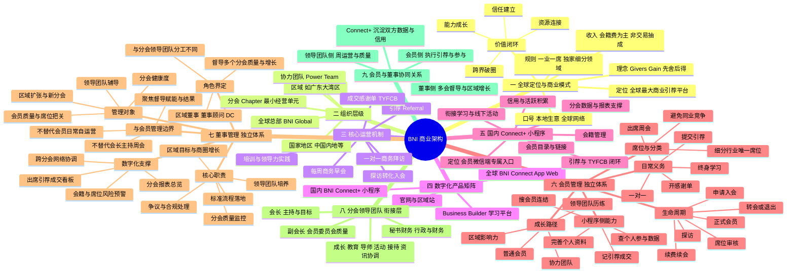

# BNI 商业架构思维导图

> 覆盖：全球商业架构 · 国内 Connect+ 小程序 · **会员管理** · **董事管理**（相互独立又协同）
>
> 配套文件：
> - `BNI商业架构思维导图.html`（完整可交互可视化，浏览器打开）
> - `BNI商业架构思维导图.mm`（可用 FreeMind / Freeplane / XMind 打开）

## 会员管理 vs 董事管理（对照）

| 维度 | 会员管理 | 董事管理 |
|------|----------|----------|
| 主体 | 分会内企业家会员 | 区域董事 / 董事顾问（DC） |
| 目标 | 个人生意增长、信任与引荐 | 分会质量、领导力、区域扩张 |
| 日常动作 | 出席、引荐、1对1、TYFCB、学习 | 督导分会、辅导领导团队、合规与增长 |
| 决策边界 | 本席位业务与分会参与 | 跨分会标准、席位争议升级、新分会 |
| 小程序重心 | 找人、记账、个人信用 | 分会看板、质量预警、区域视图 |
| 独立性 | 以分会与个人会籍闭环运行 | 独立于单会员事务，对区域结果负责 |

## 使用说明

1. 浏览器打开同目录 `BNI商业架构思维导图.html`，可筛选商业模式 / 小程序 / 会员 / 董事，点击节点查看详情。
2. 在支持 Mermaid 的编辑器中预览本 Markdown。
3. 用 **Freeplane / FreeMind / XMind** 打开 `BNI商业架构思维导图.mm` 可编辑节点、导出图片/PDF。
